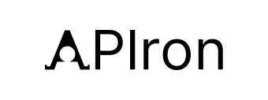

  

# 🧪 APIron-lab
**API × Apeiron × Iron**  
*An interface between the infinite and the tangible.*

---

## 🜁 Philosophy  
APIron-lab is built on the convergence of three essences:

- **API** — the structured connection, bridging systems and minds.  
- **Apeiron** — the boundless, infinite source of all ideas.  
- **Iron** — the element of form, strength, and realization.

> To connect the infinite with the structured.  
> To translate imagination into tangible creation.

---

## 🧭 Vision  
Turning ideas into tools.  
Bringing imagination to form.  
Making technology a language for everyone.

---

## ⚙️ Mission  
- Transform complex technology into accessible tools.  
- Bridge philosophy and engineering through design.  
- Empower anyone to shape their thoughts into usable reality.

---

## 🜂 Logo Concept  
The APIron logo reflects the brand’s core architecture:

- The **“A”** forms a geometric structural frame.  
- The **inner circle** represents a singularity — potential, origin, emergence.  
- The **stance** of the mark conveys stability, clarity, and forward motion.  

The logo is not merely a letterform;  
it is a visual embodiment of APIron’s philosophy:  
**from structure to infinity, from idea to realization.**

---

## 🧬 Origin  
**APIron = Apeiron + Iron + API**  
Born from the belief that creation begins where boundlessness meets structure.  
It is a conceptual brand designed for expansion — beyond preprocessing,  
toward automation, structural computing, and system-level intelligence.

---

## 💬 Japanese Summary  
APIron-lab（アペイロン・ラボ）は、  
「接続（API）」と「無限（Apeiron）」、  
そして「構造（Iron）」をつなぐ技術ブランドです。

思考と構造、哲学と工学をつなぎ、  
“発想を形にする”ための道具・仕組み・技術を開発します。

---

> *Connect. Create. Crystallize.*  
> _Forging imagination into form._

---

🧩 *Tags:* `brand` · `open-source` · `tools`  
🌐 *Description:* Turning ideas into tools — API × Apeiron × Iron
